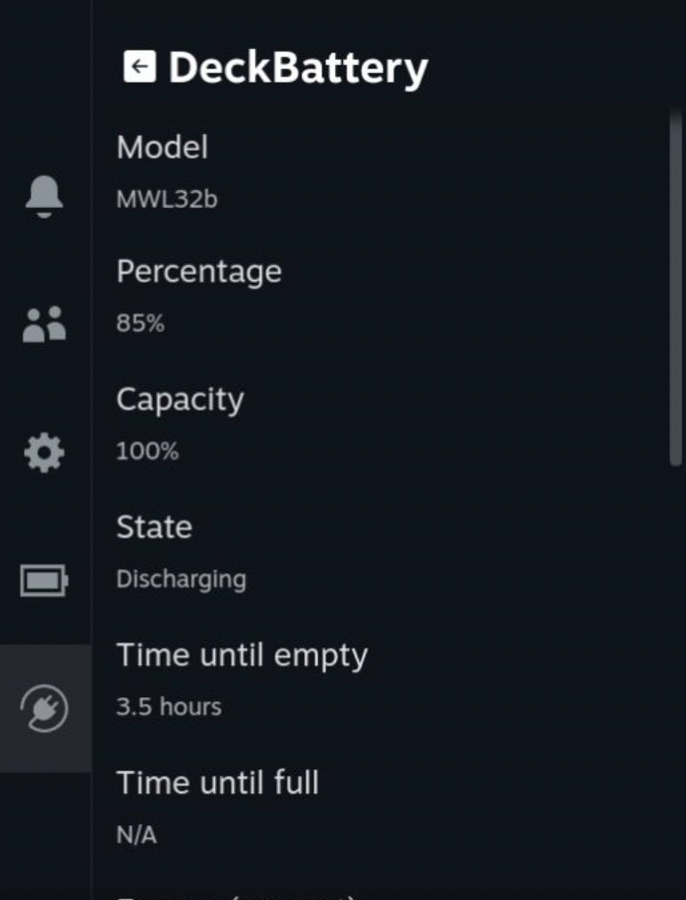

# DeckBattery

Plugin for the Steam Deck that gives you access to more info about your battery.

## Features

- Model name
- Percentage
- Capacity
- Warning level
- Status
- Time until empty/full
- Energy level
    - Current
    - When empty
    - When full
    - When full, by design
- Voltage

All this information comes from the following command: `upower -i /org/freedesktop/UPower/devices/battery_BAT1`

## How to install

Simply download the plugin and place the folder in `~/homebrew/plugins`.
